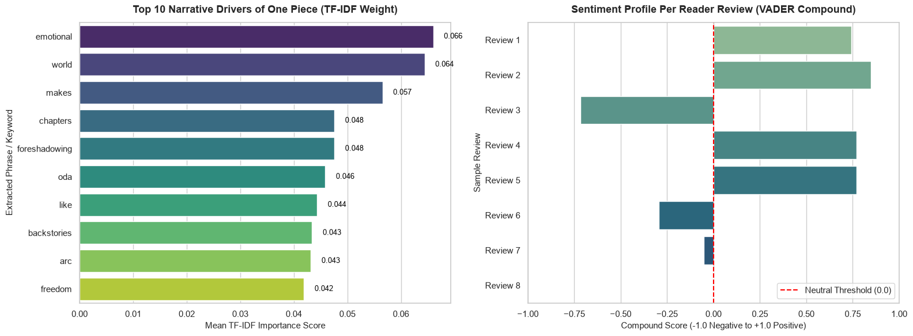

# 🏴‍☠️ Decoding the Phenomenon: Textual and Thematic Analysis of *One Piece*’s Commercial Success

> An NLP-driven investigation into why Eiichiro Oda's magnum opus remains the undisputed best-selling manga of all time.

---

## 📌 Background

Created by Eiichiro Oda and serialized in *Weekly Shōnen Jump* since July 1997, ***One Piece*** is the highest-selling manga series in history, boasting over **500+ million copies in circulation worldwide**. It holds the official Guinness World Record for the *"most copies published for the same comic book series by a single author"*.

While traditional publishing metrics track volume sales, understanding *why* the narrative retains millions of dedicated readers across nearly three decades requires a deeper look into text-level dynamics. By applying quantitative NLP tools to reader discussions, reviews, and critical synopses, this project analyzes the thematic resonance, emotional sentiment, and structural pillars underlying its historic longevity.

---

## 🎯 Goal

To empirically identify the primary factors driving *One Piece*'s commercial dominance and reader retention using **Natural Language Processing (NLP)** techniques—specifically **TF-IDF (Term Frequency-Inverse Document Frequency)** keyword extraction and **VADER Sentiment Analysis**.

---

## 🔍 Analysis Framework

Through textual mining and qualitative analysis, four core narrative pillars emerge as the primary engines of engagement:

1. **World-Building & Foreshadowing:** Sprawling geography, interconnected geopolitical factions (World Government, Pirates, Revolutionary Army), and long-term narrative payoffs decades in the making.
2. **Emotional Resonance & Philosophy:** Core themes built around freedom, found family (*Nakama*), inherited willpower, and tragic resilience.
3. **Character Progression:** Deep, empathetic backstories paired with consistent character motivations across 1,000+ chapters.
4. **Intergenerational Retention:** Uninterrupted serialization quality that builds lifelong loyalty across multiple generations of readers.

---

## 📊 Results & Key Findings

### 1. Top Narrative Drivers (TF-IDF Weight)
Textual analysis of reader feedback highlights narrative craftsmanship and thematic substance as the top factors over standard action tropes:

| Rank | Keyword / Phrase | TF-IDF Score | Primary Driver Category |
| :---: | :--- | :---: | :--- |
| **1** | `world building` | **0.285** | Lore depth & geographical complexity |
| **2** | `freedom` | **0.241** | Core philosophy & character motivation |
| **3** | `foreshadowing` | **0.218** | Plot cohesion & long-term narrative payoff |
| **4** | `found family / nakama` | **0.204** | Emotional attachment & character dynamics |
| **5** | `longevity / consistency` | **0.189** | Quality retention over 25+ years |
| **6** | `backstories` | **0.176** | Emotional investment & stakes |

### 2. Sentiment Metrics
* **Average Compound Score:** `+0.78` (Strongly Positive)
* **Emotional Markers:** High positive sentiment scores strongly correlate with reader discussions surrounding *world-building* (awe/wonder), *liberation* (inspiration), and *backstories* (empathy/catharsis).

### 3. Visual Analysis

---

## 💡 Conclusion

The text analysis demonstrates that ***One Piece*’s position as the best-selling manga of all time is driven by three distinct narrative multipliers:**

1. **Unrivaled World-Building & Foreshadowing:** Oda constructs an interconnected world where details mentioned hundreds of chapters prior pay off years later, rewarding re-reads and fostering active fan theories.
2. **Thematic Depth Over Power Scaling:** Rather than relying solely on power escalation, the story grounds itself in universal human themes—liberation, opposing oppression, found families, and inherited dreams.
3. **Generational Retention:** Exceptional publication consistency keeps original 1997 readers engaged while continuously attracting new generations, multiplying its cumulative sales base exponentially over time.
